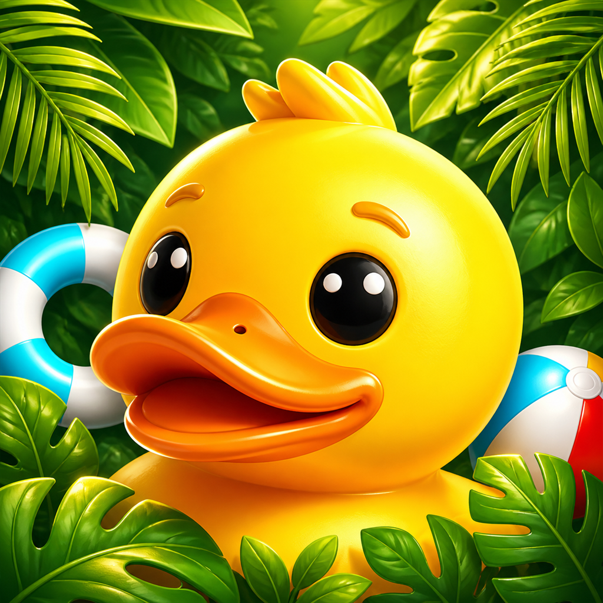
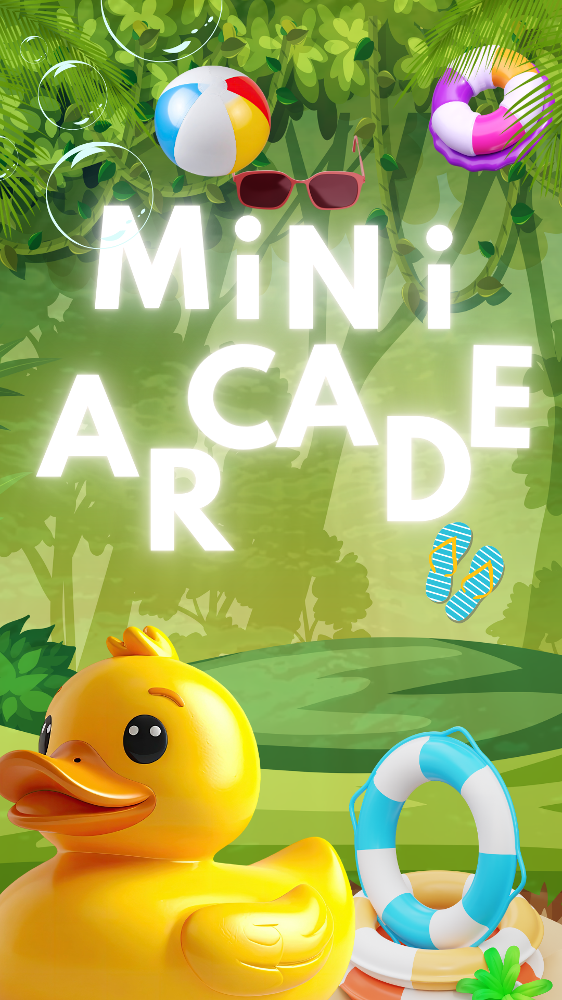
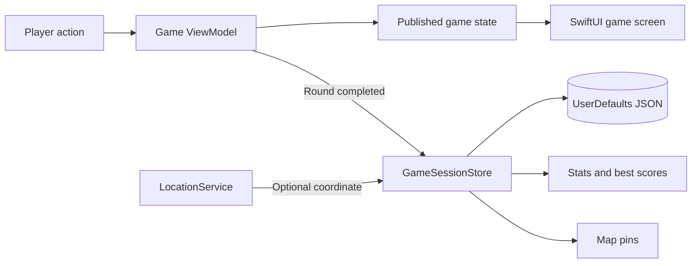

<p align="center">
  
</p>

<h1 align="center">MiNi ARCADE</h1>

<p align="center">
  <strong>Three customizable SwiftUI mini-games in one colorful, portrait arcade.</strong>
</p>

<p align="center">
  
  
  
  
  
</p>

<p align="center">
  <a href="#game-modes">Game Modes</a> |
  <a href="#app-features">Features</a> |
  <a href="#architecture">Architecture</a> |
  <a href="#run-the-project">Run</a> |
  <a href="#current-scope">Scope</a>
</p>

<p align="center">
  
</p>

## Overview

MiNi ARCADE is a native SwiftUI mini-game collection for iPhone and iPad. It combines three playable modes, persistent scores, variant-specific best scores, optional map pins, local daily reminders, audio controls, and an adventure-themed interface in one app.

| Project fact | Current implementation |
|---|---|
| Platform | iPhone and iPad, portrait orientation |
| Deployment target | iOS 18.6 |
| Interface | SwiftUI with an artwork and video launch sequence |
| Architecture | MVVM-style Views, ViewModels, Models, and shared Services |
| Persistence | JSON-encoded `GameSession` records and settings in `UserDefaults` |
| Online data | Open Trivia Database for Quiz Rush categories and questions |
| Dependencies | Apple frameworks and the system SDK; no third-party Swift packages |
| Main source root | `timer/` |

## Game Modes

### Tap Frenzy


A moving-target tap sprint with combos, bonus targets, optional traps, and a temporary bonus burst.

- **Classic:** 10-second sprint with bonuses and traps.
- **Focus:** 20-second round with slower movement and traps disabled.
- **Customization:** round duration, traps, bonus burst, and target movement speed.
- **Scoring:** normal and bonus taps add points through combo and burst multipliers. Only a trap hit removes points, with the score never dropping below zero.

### Light It Up


A reaction-grid challenge where lit tiles must be tapped before their time window closes.

- **Classic:** 60-second progression beginning at Level 1.
- **Sprint:** 30-second round beginning at Level 2 with quicker, denser lights.
- **Expert:** 45-second round beginning at Level 3 with faster timing.
- **Customization:** round duration, starting level, and extra lights per spawn.
- **Scoring:** every correctly tapped lit tile adds one point. Wrong taps and missed lights leave the score unchanged.

### Quiz Rush


A multiple-choice trivia mode powered by the free [Open Trivia Database](https://opentdb.com/) with bundled fallback questions.

- **Question counts:** 5, 10, or 15.
- **Difficulty:** Any, Easy, Medium, or Hard.
- **Categories:** loaded from OpenTDB, including General Knowledge, Computers, Science, History, Geography, Sports, and more.
- **Customization:** timed questions from 5 to 30 seconds and an optional streak bonus.
- **Scoring:** correct answers add 10 points plus the active streak bonus. Wrong answers and timeouts do not reduce the score.
- **Fallback behavior:** if a filtered request fails, the app retries without the selected category before using local questions.

Every setup has a `variantID` and readable `variantLabel`. Game screens and results calculate best scores for the matching setup, so customized rounds do not compete against unrelated presets.

## App Features

| Area | What the app provides |
|---|---|
| Home | Total score, games played, quick play, game selection, and overall best scores |
| Stats | Adventure level, XP progress, achievements, per-game run counts, best scores, and latest runs |
| Map | MapKit markers for completed sessions that contain a real saved coordinate |
| Results | Score, matching-variant best score, replay, home navigation, stars, and `ShareLink` |
| Themes | Jungle Day, Sunset Ruins, and Moonlit Forest background artwork |
| Audio and feel | Sound effects, generated background music, haptics, and separate volume controls |
| Defaults | Saved default presets plus quiz difficulty, question count, and category |
| Reminders | A repeating local daily challenge notification at the selected time |
| Persistence | Saved sessions, settings, and reminder preferences survive app restarts |

## Architecture

The project uses a straightforward MVVM-style structure. SwiftUI views render the current state, view models own game rules and timers, models describe saved data, and services handle shared device or persistence work.

```text
timer/
|-- App/
|   `-- MiniArcadeApp.swift          # @main entry point and four-tab shell
|-- Models/
|   |-- GameMode.swift               # Available games and display metadata
|   |-- GameOptions.swift            # Presets, filters, and variant metadata
|   |-- GameSession.swift            # Persisted result model
|   |-- GameBackgroundTheme.swift    # Selectable background artwork
|   `-- TriviaQuestion.swift         # Quiz question model
|-- Services/
|   |-- GameSessionStore.swift       # Score history and best-score queries
|   |-- GameSettingsStore.swift      # Persistent app and game defaults
|   |-- TriviaAPI.swift              # OpenTDB requests and local fallback
|   |-- LocationService.swift        # Optional session coordinates
|   |-- NotificationService.swift    # Local daily reminders
|   `-- AudioService.swift           # Generated sounds, music, and haptics
|-- ViewModels/                      # Game state, scoring, timers, and stats
|-- Views/
|   |-- Games/                       # Tap Frenzy, Light It Up, Quiz Rush
|   |-- Tabs/                        # Home, Stats, Map, Settings
|   `-- Shared/                      # Theme, launch, score, and result UI
|-- Assets.xcassets/                 # App icon, backgrounds, panels, and controls
|-- Resources/SplashVideo.mp4        # Full-screen launch video
`-- LaunchScreen.storyboard          # Native launch screen
```

### Score and session flow



Each completed round creates one `GameSession` containing the game mode, score, timestamp, optional coordinate, `variantID`, and `variantLabel`. `GameSessionStore` is the shared source of truth for Home, Stats, Map, and result best scores.

## Technology

| Framework | Use in this project |
|---|---|
| SwiftUI | App shell, navigation, forms, game screens, and shared UI |
| Combine | `ObservableObject`, published state, and game timers |
| Foundation | Dates, URLs, JSON encoding, networking, and `UserDefaults` |
| MapKit and Core Location | Optional coordinates and saved-session map markers |
| UserNotifications | Repeating local daily challenge reminders |
| AVKit | Splash video playback |
| AVFoundation and AudioToolbox | Generated sound effects, music, and system audio fallback |
| UIKit | Haptic generators, video-player bridging, and trivia HTML decoding support |

## Run The Project

1. Open `timer.xcodeproj` in Xcode on macOS.
2. Select the `timer` app target and an iPhone or iPad simulator running iOS 18.6 or later.
3. Build and run with <kbd>Cmd</kbd> + <kbd>R</kbd>.
4. Allow location only if you want future completed games to appear on the Map tab.
5. Enable notifications from Settings only if you want the local daily challenge reminder.

An internet connection improves Quiz Rush by loading live categories and questions. The game still has bundled fallback questions when the request is unavailable.

## Privacy And Storage

- Scores and settings stay on the device in `UserDefaults`.
- Location is optional and is attached only when a coordinate is available as a game finishes.
- A score still saves when location permission is denied or no coordinate is available.
- Daily challenges use local notifications, not remote push notifications.
- The current app has no account system, analytics SDK, advertising SDK, or remote game backend.

## Current Scope

- This is an iOS-only, portrait mini-game project.
- Scores are local to one installation; there is no cloud sync or global leaderboard.
- OpenTDB availability and selected filters can affect the online quiz set, so the app relaxes filters and falls back locally when needed.
- The repository can be inspected on Windows, but a real Swift compile, simulator run, and device validation require Xcode on macOS.

## Project Idea

The central design decision is the shared `GameSession` history. Every completed game records the same model, while Home, Stats, Map, results, and variant-specific best scores all read from that single persisted source. This keeps the three games independent without duplicating score-storage logic.
